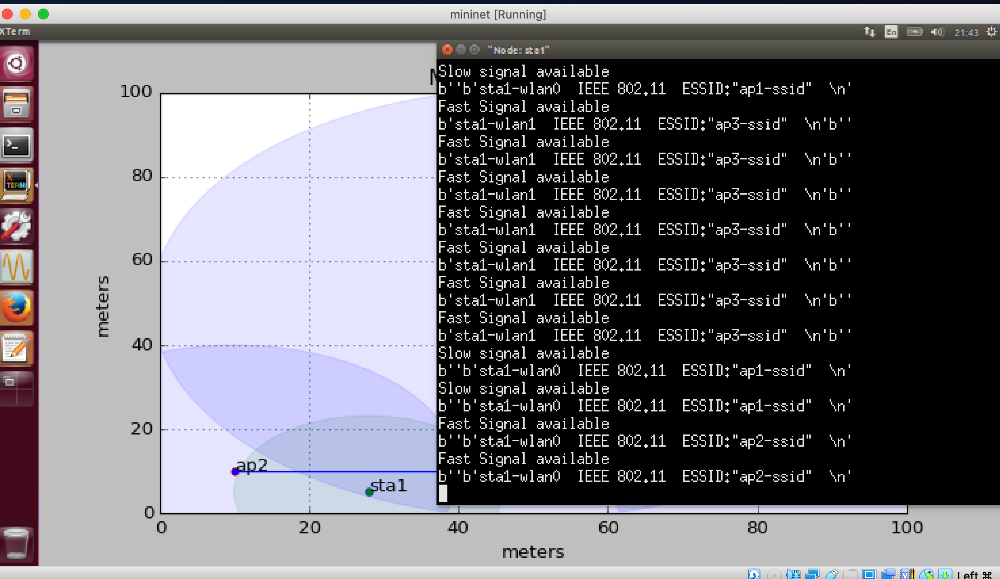

# Introduction

For this assignment, in order to create robust File Transfer Protocol, had two main candidates to use: TCP and UDP protocol.
The well-known SSH Protocol, used to log into a remote machine and execute commands is relying on TCP protocol. It uses a TCP port when connecting to it. 
TCP is a much more reliable connection than UDP because it goes through a 3 way handshake known as SYN SYN-ACK ACK which synchronizes and acknowledges the connection, thus guaranteeing delivery. TCP provides error-checking and guarantees delivery of data and that packets will be delivered in the order they were sent.

On the other hand, UDP is a connectionless protocol that assumes that error-checking and recovery services are not required. Instead, UDP continuously sends datagrams to the recipient whether they receive them or not.

Below is a comparison between them and reasons about choosing the UDP.
1. Reliability
TCP is reliable. Data sent using a TCP protocol is guaranteed to be delivered to the receiver. If data is lost in transit it will recover the data and resend it. TCP will also check packets for errors and track packets so that data is not lost or corrupted.

UDP is unreliable, it does not provide guaranteed delivery and a datagram packet may become corrupt or lost in transit.

2. Flow control
TCP uses a flow control mechanism that ensures a sender is not overwhelming a receiver by sending too many packets at once. It stores data in a send buffer and receives data in a receive buffer. When an application is read, it will read the data from the receive buffer. If the receive buffer is full, the receiver would not be able to handle more data and would drop it. TO maintain the amount of data that can be sent to a receiver, it tells the sender how much spare room in the receive buffer there is (receive window). Every time a packet is received, a message is sent to the sender with the value of the current receive window.

UDP does not provide flow control. With UDP, packets arrive in a continuous stream or they are dropped.

1. Ordering
TCP does ordering and sequencing to guarantee that packets sent from a server will be delivered to the client in the same order they were sent.
On the other hand, UDP sends packets in any order.

2. Speed
TCP is slower than UDP because it has a lot more to do. TCP has to establish a connection, error-check, and guarantee that files are received in the order they were sent.

````UDP, since it doesn’t have to do error-checking and guarantee files receivement, it is much faster.````

For this assignment, it was required to maximize the volume of traffic transferred and thus UDP will be an obvious choice as the packet flow won't be limited by window size as in TCP. 

I decided to opt-in for UDP protocol because of the speed and traffic maximization.

This approach follows a classical client-server architecture, where the communication needs to happen between them continuously. Having in mind that UDP does not offer error-checking and that packets might be lost during the way, I created a solution to handle those missing features, without affecting the performance.

This program features a checksum verification as well, among the packet loss tracking.

### program includes the following features:

1. Heartbeat protocol to keep both parties up-to-date with the status of the file transfer.
2. Intelligent loss variable which tracks the packets loss during the transfer and sends them again when the client is reconnected to the server
3. Checksum verification to verify that all the chunks are received and when merged, they have the same hash as the original file.
4. Logging to keep track when transfer breaks. It logs the exact chunk number that failed to transfer. Includes other important information as well.


# Design Description

## Basic structure
Protocol is based on the UDP file transfer scenario where client transfers the file to a server. There are 2 servers that are running on same port but different ip address. One of them is a slow server which binds to IP 10.0.0.3 and second one is a fast server 10.1.0.3.

## Mini-net scenario considerations

Using the principle of mobile offloading, I understood that there are 3 fast access points which mimic WLANs while ap1 which is a slow access point mimics mobile data. As a result, I classified these 3 access points as fast servers while remaining access point ap1 is classified as slow server


## Basic running

Client handles the responsibility of ensuring the transfer. This is done with the help of MyClient.py written in Python which transfers the file by breaking it into number of chunks. These chunks are then loaded with additional data such as 

1. Sequence number and chunk no: This tells the server which packets belong to which chunks so that it becomes possible to construct the original file by mapping chunks sequence number to appropriate location

2. Intelligent loss parameter: This variable ensures that the server understand the network loss characteristics which will help in sending the final acknowledgement atleast 2\*loss parameter so that client gets the final acknowledgement.
3. Dictionary:  Use of python dictionaries for storing and mapping which packets are actually being received at the server. Server sends this dictionary when it can no longer read the data from the socket ensuring that no more data is being sent by the client. 

## Why Dictionaries and how it ensures the reliability in our protocol 

Dictionaries acts as the means of reliability by keeping a map of which packets are actually being received. If the client understands that some packets are being lost then client can resend those packets again by checking the dictionary reply.

Meanwhile, when all enteries in the server dictioary are 1,server ensures that it can close connection and start writing the received packets to the new file as all the required packets are being acquired.


## How to maximize efficiency?

Whenever a slow or fast network is available, I start the independent python process which starts transfer of file to appropriate server.

In case of only slow connection, only slow process is started and in case of only fast connection, fast process is started.

In case of both connection, I checked the status codes of the each process. It might be possible that file transfer has began in the slow connection and station is now fast connection. We keep slow process alive, however I did check first if the fast process which is started has finished before checking for slow process.

In overall case, I ensured that process which makes file transfer first wins and the program halts with a success.

## How to handle link loss

In case of loss of connection which is defected by program every 3 seconds, I killed the corresponding process. That is if a fast connection is lost before file transfer is completed, I killed it. Same goes for the slow process.

Also note that use of Popen ensures that file transfer subprocess are not affected by the program.


## How does design of mobility affects the protocol.

It affects our protocol drastically as it cannot be a simple client server program in a reliable network. Mobility brings in several factors which were discussed above such as

1. Reliable connection.
2. Loss of packets.
3. Multiple networks.
4. Principles of mobile offloading.


# Source Code Description.


Most of our code is heavily commented and on most of the lines, it would be better to explain various files and what they mean.

### MyServer.py

Server file which performs the main function of being a server. This file is responsible for tweaks in the server functionality. This is a slow server file since it binds on the ip address 10.0.0.3.

### MyServer2.py

Fast server similar to the above file but it runs on the ip address 10.1.0.3

### MyClient.py

Client file that performs the actual transfer of file to the server. It accepts the server IP as an argument which then starts the transfer to the appropriate server.

### u2.py

This file handles all context related to mobility and server issues. It also ensures *heartbeat*.


# Test Cases 





As you can see, our protocol is able to display the SSIDs of fast and slow connection. I can also see that station is range of both ap1 and ap2.


As you can see the MyServer2 receives the file using fast transfer done on access-point 2 . Xterm h1 is running a fast server and xterm on sta1 runs our *u2.py* file. In addition also the timing visible on both screenshots at top corner verifies the same.


As you can see the MyServer receives es the file using fast transfer done on slow network.


Detection of lost signals and eventually stopping of the program.

# Performance evaluation

I transferred files under scenario. I display some of the results in the table below.

| Files            | Network| Time  | Size |
| ---------------- |:-------| -----:| ----:|
| client.py        | Slow   | 3.76  | 587b |
| client.py        | Fast   | 3.07  | 587b |
| base_scenario.py | Slow   | 12.87 | 2720b|
| base_scenario.py | Fast   | 3.06  | 2087b|


I checked that performance in fast network is significantly faster in fast network as expected.


